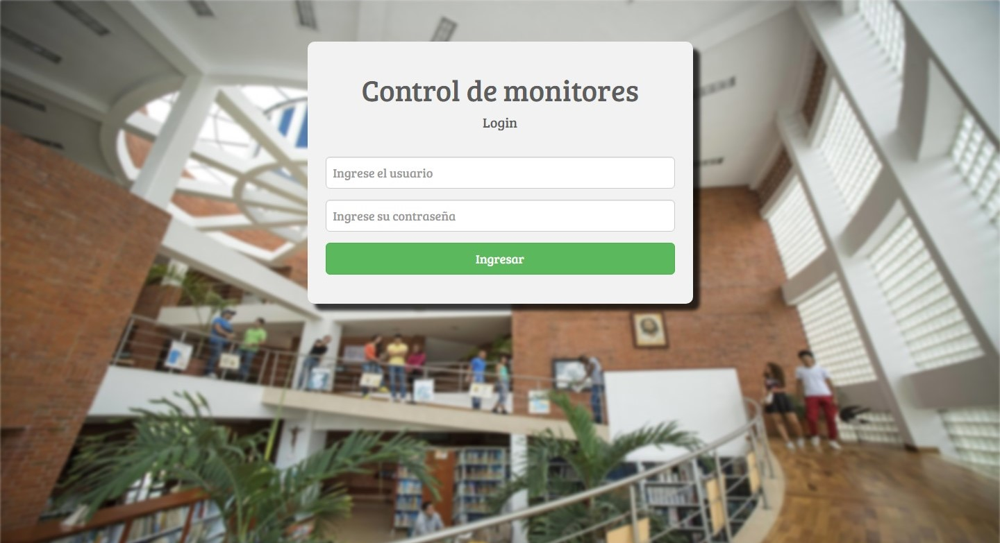
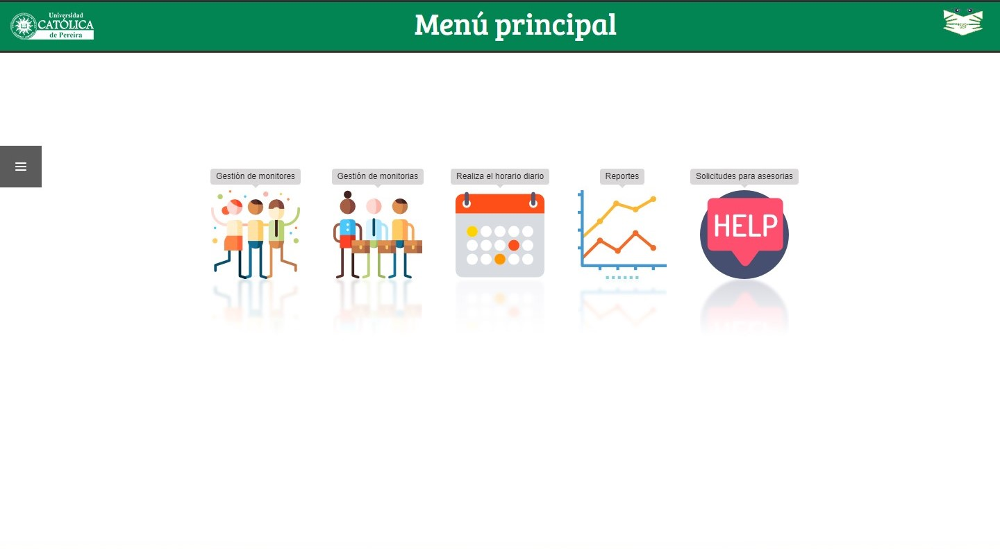

# [Control de monitores - Biblioteca](http://localhost/controldemonitores/)

Esta plataforma se creo para la gestion de los monitores de la biblioteca Cardenal Darío Castrillón Hoyos 
# Preview
## Login
El login esta desarrollodo para redirecionar el tipo de usuario a la vista que le pertenece que son Aministrador(estandar),Monitores,Administrador(Biblioteca).

## Menu principal (Administradores).
Esta en la pagina principal o menu principal para los administradores de la biblioteca la cual esta dividida por sub modulos los cuales son <b>gestión de monitores:</b> En este submodulo se puede registrar monitores,Modificar la información del monitor

En la parte

# Tecnología para el desarrollo
- HTML
- Css
- Javascript
    - AJax
- Php
    - Codeigniter (MVC)
- Mysql
- Libs
    - Jquery
    - Boostrap
    - AnimateCss
    - Datatables
    - Timepickerange
    - Timpicker
    - Jquery Mobile

